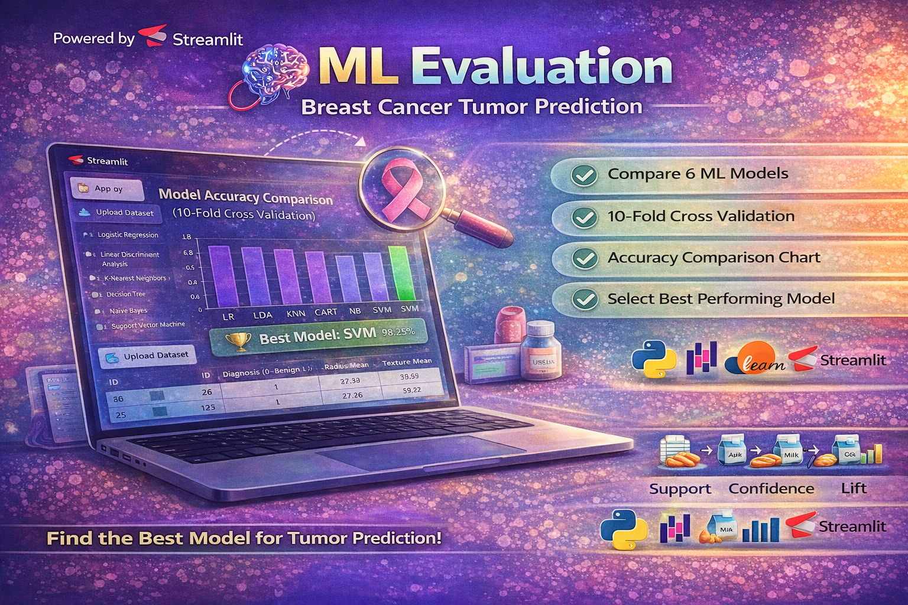

  

---

# 🧠 ML Evaluation - Breast Cancer Tumor Prediction

A Machine Learning project that compares multiple classification algorithms to predict breast cancer tumors and identifies the best-performing model using cross-validation.

## 🚀 Project Overview

This project focuses on evaluating different Machine Learning algorithms for breast cancer tumor classification. It uses 10-Fold Cross Validation to ensure reliable performance comparison and selects the best model based on accuracy.

## 🎯 Objectives

- Compare multiple ML algorithms  
- Evaluate model performance using cross-validation  
- Identify the best model for tumor prediction  
- Visualize model performance  

## 🤖 Machine Learning Models Used

- Logistic Regression (LR)  
- Linear Discriminant Analysis (LDA)  
- K-Nearest Neighbors (KNN)  
- Decision Tree (CART)  
- Naive Bayes (NB)  
- Support Vector Machine (SVM)  

## 📊 Features

- Upload custom dataset (CSV)  
- Model comparison visualization  
- Accuracy score display  
- Best model selection  
- Interactive Streamlit dashboard  

## 🛠️ Tech Stack

- Python  
- Pandas  
- NumPy  
- Scikit-learn  
- Matplotlib  
- Streamlit  

## 📁 Project Structure

ML_Evaluation_BreastCancer_Tumor/
│
├── app.py
├── dataset.csv
├── requirements.txt
└── README.md

## ⚙️ Installation & Setup

1. Clone the repository:
git clone https://github.com/selvan-01/Breast_Cancer_Tumor_Prediction_XGBOOST_ML.git
cd ml-evaluation-breast-cancer

2. Install dependencies:
pip install -r requirements.txt

3. Run the application:
streamlit run app.py

## 📸 Output

- Model accuracy comparison chart  
- Best performing model highlighted  
- Dataset preview interface  

## 🧠 Key Concept

This project uses Stratified K-Fold Cross Validation to ensure each fold maintains the same class distribution, providing more reliable evaluation compared to simple train-test split.

## 📌 Future Improvements

- Add XGBoost and Random Forest  
- Include confusion matrix visualization  
- Add feature importance analysis  
- Deploy the app online (Streamlit Cloud)  

## 👨‍💻 Author

S. Senthamil Selvan  
Email: senthamils445@gmail.com  
Location: Tamil Nadu, India  

## 🔗 Links

- 💼 [LinkedIn](https://www.linkedin.com/in/senthamil45)
- 🌍 [Portfolio](https://senthamill.vercel.app/)
- 💻 [GitHub](https://github.com/selvan-01/Breast_Cancer_Tumor_Prediction_XGBOOST_ML.git) 

## ⭐ Support

If you found this project useful, please star the repository and share your feedback!
